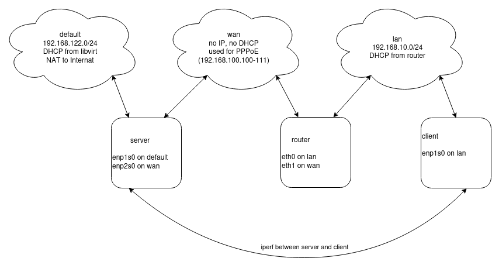

# Opinionated Router Benchmark
My home Internet connection is a VDSL, fibre to the cabinet which comes over the telephone line into a BT master socket which has an ADSL filter and requires a modem. The modems are now usually built into the BT Home/Smart Hub CPE (Customer-premises equipment) but I still use a Huawei HG612 standalone modem as I don't particluraly like the CPE I was given. So I need router to talk PPPoE to the modem and also firewallm route and NAT my home lan traffic to the Internet. I used a pair of Linksys WRT3200ACM devices: one as a router and wireless access point and the other as just a wireless access point. However while I was quite happy with them, the overall experience was not great: Ring devices would not connect, Tapo devices would not upgrade firmware and the overall signal quality around the house was not very good. So I upgraded to some Aruba Mesh style wireless access points, which turned out to be great. However this left most of the functionality of the WRT3200ACM unneeded in what is quite a large physical footprint, also I don't want to overload the device by turning my internet router into a NAS. Thus I needed to find a replacement device that just does the routing. Also with the new access points I also changed to a managed network swtiches with vlans to allow guest wifi, untrusted iot network, etc. Thus the new decice could just be a single port router on a stick setup with a single trunk link.

My random set of requirements for the new device:
 * can do the right tech networking stuff: eg pppoe, vlans, nat, firewall, dhcp, dns resolver, local dns registration, ntp
 * be as open as possible
 * reasonable gui/cli: probably openwrt (as mostly everything else is rubbish and openwrt seems least worse)
 * easy to swap and obtain new hardware in case of failure (eg Raspebrry Pi's are (used to be) available)
 * easy to backup config or capture steps to configure replacement device
 * no fans and no spinning rust
 * serial console (eg no usb keyboard/screen for debugging)
 * small, wall mountable and lower power (eg <20W)
 * link and status leds
 * simple to boot and work
 * simple (eg I don't want virtual machine stack with 1000 things to go wrong)
 * ideally multiple ports to make the setup simple (eg with a single port router on a stick, bootstrapping the mgmt interfaces on a vlan is harder)

I decided on a few devices, however I was unsure how each performed. The goal of this benchmark is run iperf from a fake client to a fake server and thus end to end test a routers bandwidth. Once an initial set of benchmarks are run on a virtual router the individual devices can then be tested by using vlans. By connecting the test host to a trunked port and adding the untagged interfaces for the wan and lan network to the wan and lan virtual bridges the test virtual router can be switched off and the device under test can be benchmarked.

## Device under test
 * [EdgeRouter Lite 3](https://dl.ui.com/datasheets/edgemax/EdgeRouter_DS.pdf) [£21.00](https://ebay.co.uk)
 * [GL.iNet GL-AR150](https://www.gl-inet.com/products/gl-ar150/) [£21.30](https://www.amazon.co.uk/gp/product/B015CYDVG8/)
 * [Linksys WRT3200ACM](https://www.linksys.com/gb/wrt3200acm-ac3200-mu-mimo-gigabit-wi-fi-router/WRT3200ACM-UK.html) Currently bizarrely expensive
 * [Raspberry Pi 3 Model B](https://www.raspberrypi.com/products/raspberry-pi-3-model-b/) Currently unobtainable
 * [Raspberry Pi 4 Model B](https://www.raspberrypi.com/products/raspberry-pi-4-model-b/) Currently unobtainable

## Benchmark tools
 * iperf3 - bandwidth
 * ping - latency

## Network setup
The test setup creates some networks using libvirt the three required networks and three test virtual machines. The server virtual machine is connected to the default network which allows the host to ssh in. It it also on a wan network without any IP, the server runs the PPPoE process on this network, emulating the ISP. The router virtual machine is also on the wan network and runs the PPPoE client and connects to the server and uses the server as its router. It's also connected to a separate lan network which it runs dhcp services for. The final virtual machine called client it only connected to the lan network.




## Create virtual network
These are the commands I ran to create the two virtual machines and see the virtual bridge device names which are used for the VM creation commands below.
```
for n in lan wan; do echo "<network><name>$n</name></network>" > /tmp/net.xml; sudo virsh net-define /tmp/net.xml; sudo virsh net-start $n; sudo virsh net-autostart $n; done

def=$(sudo virsh net-info default | awk '/Bridge:/{print $2}')
lan=$(sudo virsh net-info lan | awk '/Bridge:/{print $2}')
wan=$(sudo virsh net-info wan | awk '/Bridge:/{print $2}')
echo "def:$def lan:$lan wan:$wan"
```

## Create server
Next create a new virtual machine with virt-install and inject a preseed file. It's mostly boiler plate Debian install.
```
echo "H4sIAAAAAAAAA4VUTY/TMBC991dYi5DgkHoXOC0CaSWOK0BaCS5IkRtPErOOJxpPmlar/e9M6qRNGxaqtrGdN19vxu9V3hJEAJv/uFmtbOZUAC7KSlfAeY2Rg2lARSYXKhWBtkCXKIuNcWHCeBPmgKJGjJC7wEClKcQVeChYmY4xxav7zALLmfZobF46anpDoDaIHkxQTB0kZOOIkHSBXWDaTwEbEzrj54CaudWXuVvYrOXnTFgjVQu4dSQp4MmtTuAFsCXcTaCUVmti7K0mRM48VkLFlHppfIQ5phMGs7Lz/iKzKdAM9n9EdlgjWbVYvAjNTDX0amkwWhALndnQHN0A12inFAiqzhtawsYGC3uuPXb3dydmwscSDrsWiI/w5HyCq9tb9Wulxs/Ndfpev1aw4w8qJfSkSqTGsHoeF0+ykhplcDzEfWRohpP57mD9rJphblqUUXxSWvbr86L9tpGeb10xFNPgFnI5OZ/COXx4OnYYpAAZyTDMbd6TY8gD9Lk3G/AvWk+sHZ1MxJUuuFifQ5Pvf/gagweUpOmQwstpb0x0xYmcqAPmsTftxcwebEzLWQTuWl1YwkbLOpNIkS/BLbbDcDjeZ5IMgyCWR/pQrLTdzPIbHbCJj8KAGp86RWk6z24kJrIJ1kyT/VgNKBcK39mTOsVaxc6iksmi8r082Gyk0FRMRd0mc0H8eA+kMfh9nu7VkqwLrLxnmYzTbSyNZHZApn5NWE0wYEXtRFWxEmGNKiAnpynYzC3snJCCPRCW5V/kbhRm7YWwvMBG2ne8jqdbAjJK6mqs5O7+/tMb+Xurvn77fvfw8PPLreyu1Gel2ZCItRZV1gNJQHFtR41THy/9ZaCuJEnssxq59V2lILTv4vWv4A4innbKiciP+isxzoPIKxGWR31U/iFeslv9AdxbVjZ1BgAA" | base64 -d | gunzip > preseed-server.cfg
sudo virt-install --connect qemu:///system --name server --os-variant debian11 --memory 1024 --disk size=20 --location http://deb.debian.org/debian/dists/bullseye/main/installer-amd64/ --network bridge=$def,model=virtio --network bridge=$wan,model=virtio --extra-args 'language=en country=GB keymap=gb file=/preseed-server.cfg' --initrd-inject=preseed-server.cfg
```

The server needs to become a router, nat traffic and be the iperf server.
```
echo "net.ipv4.ip_forward=1" | sudo tee /etc/sysctl.d/local.conf
sudo iptables -t nat -A POSTROUTING -o enp1s0 -j MASQUERADE
sudo iperf3 -s
```

## Setup accel-ppp on server
The server needs to run accel-ppp to run a PPPoE server see below [#On ppp/pppoe vs accel-ppp] on this selection. This is not packaged so need to be compiled and installed.
```
sudo apt-get install -y build-essential cmake gcc linux-headers-`uname -r` git libpcre3-dev libssl-dev liblua5.1-0-dev
git clone https://github.com/accel-ppp/accel-ppp.git
mkdir accel-ppp/build
cd accel-ppp/build
cmake -DCMAKE_INSTALL_PREFIX=/usr -DLUA=TRUE -DCPACK_TYPE=Debian11 ..
make
cpack -G DEB
sudo dpkg -i accel-ppp.deb
```

The setup for accel-ppp was also pretty straight forward, it seems that accel-ppp is quite nice to work with.
```
echo "H4sIAAAAAAAAA3VR7WrDMAz8r2eZ4ygb+wI/SQjFc5QPcGMjOyl7+yluKQ10GIMlnU6nc3sO/eopdeDDeBpmTxBjDAR2zdMp2ghuslElckw5wSy14AFaF5hKjyLmwEZvlrWE2jpHXgmH3iGVpCBPTLZXLqxLNm/SXCZ0sBH/hEQGhVbtvOY6el4y8WAdGVpik2rpuAE6GC9K3rbvmVIy+NVU+P5ZYV3vF44xKkR8WeyZbsTQipyr6n3TZ6Lvr6K87HcmHp9BS+EOG+zs/2cVMwuiwF2Iv7K0p428ed3NfLC4OxhuNGWnD18gcD8/mpfJL5QNNh9VLQe/m1qsyC4eUwh/wodkSOwBAAA=" | base64 -d | gunzip | sudo tee /etc/accel-ppp.conf
echo "debian * password *" | sudo tee /etc/chap-secrets
sudo systemctl start accel-ppp
sudo systemctl enable accel-ppp
```

## Create router
The virtual test router was created again with virt-install the openwrt x86 image was used
```
wget -c https://downloads.openwrt.org/releases/22.03.2/targets/x86/64/openwrt-22.03.2-x86-64-generic-ext4-combined.img.gz
cat openwrt-22.03.2-x86-64-generic-ext4-combined.img.gz | gunzip > openwrt-22.03.2-x86-64-generic-ext4-combined.img
sudo qemu-img convert -f raw -O qcow2 openwrt-22.03.2-x86-64-generic-ext4-combined.img /var/lib/libvirt/images/openwrt.qcow2
sudo virt-install --connect qemu:///system --name openwrt --os-variant linux2020 --memory 1024 --import --disk path=/var/lib/libvirt/images/openwrt.qcow2 --network bridge=$lan,model=virtio --network bridge=$wan,model=virtio 
```

After the router starts some initial setup needs to be performed to confgure the network, eg
```
uci set network.lan.ipaddr='192.168.10.1'
uci set network.wan.proto='pppoe'
uci set network.wan.username='debian'
uci set network.wan.password='password'
uci commit
reboot
```

A new rule needs to be added to /etc/config/firewall to allow ssh traffic to the wan:
```
config rule
	option name allow-ssh
	list proto tcp
	option src wan
	option dest_port 22
	option target ACCEPT
```

If tcpdump is needed to help debug, it can be installed with
```
opkg update
opkg install tcpdump

```

## Create client
The client virtual machine was also installed via virt-install, using an almost identical setup to the server machine.
```
echo "H4sIAAAAAAAAA4VUwWrcMBC95ytESqE9eJXQngItBHoMbSHQXgpGa41tNZLGjMbxLiH/3vHK3nXWTbtkY1n7NPPmzdO8KTuCBGDLH9cXF7ZwKgJXdaMb4LLFxNEEUInJxUZV3kHkc5TFYFycMd7EJaBqEROULjJQbSoJBR4qVqZnzPnaobDAsqc9GlvWjsJgCNQW0YOJiqmHjAyOCElX2Eem/ZwwmNgbvwS0zJ0+525hu5GvM3GD1Kzg1pFQwFNYncErYEe4m0GZVmdSGqwmRC48NiLFTL02PsES0yegou69P2M2J1rA/o8oDmskq1aLV6GFacZerQ9MJ4hFzmJsjg7ALdqZAkHTe0Nr2NRgUc91x+7+7uWY6LGGw64D4iM8B5/h6uZG/bpQ0+f6Kv9dvVWw448qE3pSNVIwrJ6nxZOspEYxjoe0Twxh3Fm+HU4/qzD6pkOx4pPS8r55WbR/DNLzR1eNxQR8hFJ2XrpwCR+fjh1GKUAsGUfflgM5hjLCUHqzBf/q6Vm1Y5BZuNpFl9qX0Bz7H7Gm5BGFNB0ovE57a5KrTuIkHbFMg+nOPHs4YzouEnDf6coSBi3rQjIlPgd32I3mcLwvhAyDINZb+lCstN0s+E0B2KQHUUBNT52zhN6zm4RJbKI1s7MfmhHlYuV7e3RRSq1KvUUlzqL6gzzYbKXQXExD/bZwUeJ4D6Qx+n2Z79VarDOs/M7ijNNtrI0wOyBzv2asJhixMu1kqmIjgzWpiJyD5mSLsLBzIgoOQFjXfxl302DWXgQrKwzSvuN1PN0SECupy6mS27u7T+/k33v19dv32/v7n19u5O1SfVaaDcmw1jKV9SgSUNrYecb9Adx6/rMFBgAA" | base64 -d | gunzip > preseed-client.cfg
sudo virt-install --connect qemu:///system --name client --os-variant debian11 --memory 1024 --disk size=20 --location http://deb.debian.org/debian/dists/bullseye/main/installer-amd64/ --network bridge=$lan,model=virtio --extra-args 'language=en country=GB keymap=gb file=/preseed-client.cfg' --initrd-inject=preseed-client.cfg
```

The client can then benchmark the setup by running
```
ping 
iperf3 -c 192.168.122
```

## On ppp/pppoe vs accel-ppp
During the benchmark I originally setup pppoe on the server as below:
```
apt-get install pppoe
/etc/ppp/pppoe-server-options:
    require-pap
    login
    lcp-echo-interval 10
    lcp-echo-failure 2
    ms-dns 8.8.8.8
    #defaultroute
sudo pppoe-server -I enp2s0 -L 192.168.100.100 -R 192.168.100.101 -N 20
```

However it became immediately obvious that the warning in the [man page](https://manpages.debian.org/testing/pppoe/pppoe-server.8.en.html) stating "Note that pppoe-server is meant mainly for testing PPPoE clients. It is not a high-performance server meant for production use" is correct. My very first iperf ran was not getting above about 500Mbits:
```
debian@client:~$ iperf3 -c 192.168.122.95
Connecting to host 192.168.122.95, port 5201
[  5] local 192.168.10.191 port 44110 connected to 192.168.122.95 port 5201
[ ID] Interval           Transfer     Bitrate         Retr  Cwnd
[  5]   0.00-1.00   sec  75.7 MBytes   635 Mbits/sec  197    128 KBytes       
[  5]   1.00-2.00   sec  65.1 MBytes   546 Mbits/sec  119   99.8 KBytes       
[  5]   2.00-3.00   sec  64.1 MBytes   538 Mbits/sec   66    105 KBytes       
[  5]   3.00-4.00   sec  67.2 MBytes   564 Mbits/sec   72    131 KBytes       
[  5]   4.00-5.00   sec  96.3 MBytes   808 Mbits/sec  304    134 KBytes       
[  5]   5.00-6.00   sec  85.0 MBytes   713 Mbits/sec  305    105 KBytes       
[  5]   6.00-7.00   sec  60.3 MBytes   506 Mbits/sec  124    121 KBytes       
[  5]   7.00-8.00   sec  41.2 MBytes   345 Mbits/sec   15    132 KBytes       
[  5]   8.00-9.00   sec  37.1 MBytes   311 Mbits/sec   22    115 KBytes       
[  5]   9.00-10.00  sec  35.2 MBytes   295 Mbits/sec   21    115 KBytes       
- - - - - - - - - - - - - - - - - - - - - - - - -
[ ID] Interval           Transfer     Bitrate         Retr
[  5]   0.00-10.00  sec   627 MBytes   526 Mbits/sec  1245             sender
[  5]   0.00-10.05  sec   626 MBytes   523 Mbits/sec                  receiver

iperf Done.
debian@client:~$
```

Which led me to try accel-ppp which immediately got >5G, which is fine given the limitation of the eventual test setup with 1G ethernet
```
debian@client:~$ iperf3 -c 192.168.122.95
Connecting to host 192.168.122.95, port 5201
[  5] local 192.168.10.191 port 47560 connected to 192.168.122.95 port 5201
[ ID] Interval           Transfer     Bitrate         Retr  Cwnd
[  5]   0.00-1.00   sec   581 MBytes  4.88 Gbits/sec   82   1.24 MBytes       
[  5]   1.00-2.00   sec   525 MBytes  4.40 Gbits/sec    0   1.49 MBytes       
[  5]   2.00-3.00   sec   616 MBytes  5.17 Gbits/sec    8   1.28 MBytes       
[  5]   3.00-4.00   sec   776 MBytes  6.51 Gbits/sec    0   1.65 MBytes       
[  5]   4.00-5.00   sec   761 MBytes  6.39 Gbits/sec   57   1.51 MBytes       
[  5]   5.00-6.00   sec   786 MBytes  6.60 Gbits/sec    8   1.37 MBytes       
[  5]   6.00-7.00   sec   659 MBytes  5.53 Gbits/sec    0   1.67 MBytes       
[  5]   7.00-8.00   sec   741 MBytes  6.22 Gbits/sec   14   1.52 MBytes       
[  5]   8.00-9.00   sec   775 MBytes  6.50 Gbits/sec   25   1.36 MBytes       
[  5]   9.00-10.00  sec   665 MBytes  5.58 Gbits/sec  173   1.22 MBytes       
- - - - - - - - - - - - - - - - - - - - - - - - -
[ ID] Interval           Transfer     Bitrate         Retr
[  5]   0.00-10.00  sec  6.72 GBytes  5.78 Gbits/sec  367             sender
[  5]   0.00-10.04  sec  6.72 GBytes  5.75 Gbits/sec                  receiver

iperf Done.
debian@client:~$
```

## Results
